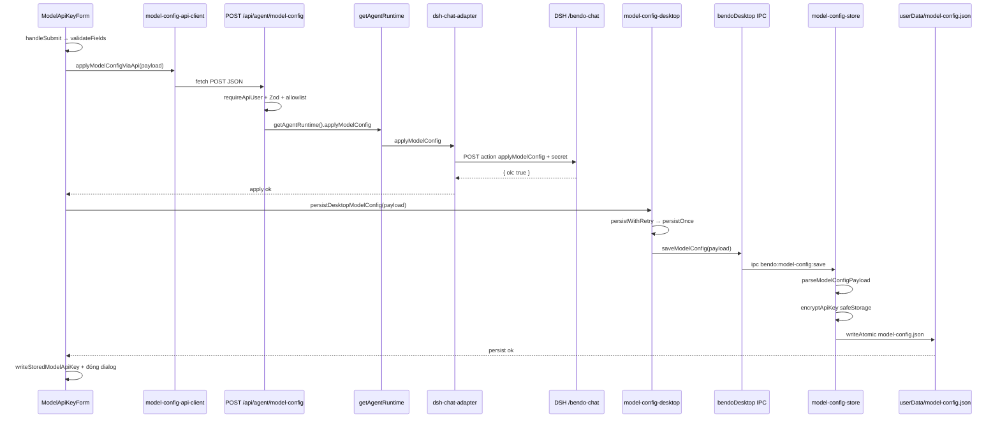
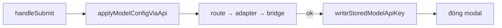
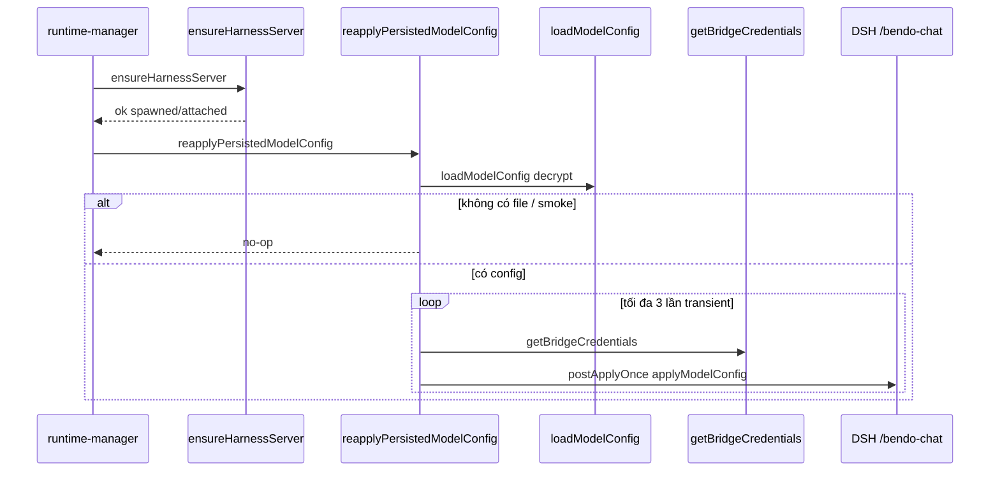

# Agent model config — Save / persist / re-apply workflow

Sơ đồ pattern **Save = apply ∧ persist** (bước C) và chuỗi function gọi tuần tự. Không thay `bendo-app/AGENTS.md` §10.

**Liên quan:** [`agent-model-dynamic-route-ab.md`](./agent-model-dynamic-route-ab.md) (apply A–B), [`desktop-electron-startup-flow.md`](./desktop-electron-startup-flow.md) (startup).

---

## 1. Hai luồng

| Luồng | Khi nào | Mục tiêu |
| --- | --- | --- |
| **A. Save (user)** | User bấm Save trong modal Agent | Apply vào harness **rồi** (desktop) persist `userData` |
| **B. Startup re-apply** | Electron: harness ready | Đọc durable file → bridge `applyModelConfig` lại |

Chat turns **không** nằm trong Save: vẫn thin (`/api/agent/chat` → bridge message only).

---

## 2. Overview (desktop)

```mermaid
flowchart TD
  subgraph saveUser [A. Save — user]
    U[User Save] --> V[validateFields]
    V --> A1[applyModelConfigViaApi]
    A1 --> N[POST /api/agent/model-config]
    N --> R[runtime.applyModelConfig]
    R --> BR[bridge action applyModelConfig]
    BR --> H[Harness: credentials + llm-pi-ai + selection]
    H -->|apply OK| D{window.bendoDesktop?}
    D -->|có| P[persistDesktopModelConfig]
    P --> IPC[IPC bendo:model-config:save]
    IPC --> ST[saveModelConfig → userData/model-config.json]
    ST -->|persist OK| SS[writeStoredModelApiKey sessionStorage]
    D -->|không| SS
    SS --> OK[Đóng modal — đã lưu]
    A1 -->|apply fail| ERR1[saveError — không persist]
    P -->|persist fail sau retry| ERR2[saveError — không coi là đã lưu]
  end

  subgraph startup [B. Startup re-apply]
    ER[ensureRuntimes] --> EH[ensureHarnessServer]
    EH -->|harness ok| RA[reapplyPersistedModelConfig]
    RA --> LD[loadModelConfig decrypt]
    LD --> PA[postApplyOnce → bridge applyModelConfig]
    PA -->|ok| LOG[log re-apply ok]
  end
```

---

## 3. Luồng A — Save (function tuần tự)

### 3.1 Desktop (Electron)

### 3.2 Chuỗi function (Save — desktop)

Thứ tự gọi thực tế:

1. `ModelApiKeyForm.handleSubmit` — `components/agent/model-api-key-dialog.tsx`
2. `validateFields(true)` — cùng file
3. `applyModelConfigViaApi(payload)` — `lib/agent/model-config-api-client.ts`
4. `POST` handler — `app/api/agent/model-config/route.ts`
5. `requireApiUser` + `bodySchema.safeParse` (Zod + `isAllowedModelEndpoint`)
6. `getAgentRuntime()` — `lib/agent/agent-runtime.ts`
7. `runtime.applyModelConfig(...)` → `createDshChatAdapter().applyModelConfig` — `lib/agent/dsh-chat-adapter.ts`
8. Bridge `POST` `{ action: "applyModelConfig", provider, endpoint, apiKey, model }` + `x-bendo-chat-secret`
9. Harness chat-bridge apply (credentials / `llm-pi-ai.providers` / selection) — overlay Doro
10. *(chỉ desktop)* `hasDesktopModelConfigPersist()` → `persistDesktopModelConfig` — `lib/agent/model-config-desktop.ts`
11. `persistWithRetry` → `persistOnce` → `window.bendoDesktop.saveModelConfig`
12. Preload `ipcRenderer.invoke("bendo:model-config:save")` — `desktop/src/preload/preload.ts`
13. Main `saveModelConfig` — `desktop/src/main/model-config-store.ts`
    - `parseModelConfigPayload`
    - `encryptApiKey` (`safeStorage`)
    - `writeAtomic` → `userData/model-config.json` (`apiKeyEncrypted`)
14. `writeStoredModelApiKey` — `lib/agent/model-api-key.ts` (session cache)
15. Đóng modal

**Fail rules**

| Bước fail | Hành vi |
| --- | --- |
| Validate / apply | Dừng; **không** gọi persist; hiện `saveError`. **Không** auto-retry apply trên Save (tránh lặp lỗi cứng Zod / allowlist / harness 400) |
| Persist (sau apply OK) | Retry tối đa 3 lần (`persistWithRetry`); vẫn fail → `saveError`, **không** đóng thành công, **không** ghi session như “đã lưu mới” |
| Encryption unavailable | `saveModelConfig` trả lỗi; không ghi plaintext key |

### 3.3 Non-Electron (browser / Docker UI)

Bỏ bước 10–13. Sau apply OK chỉ `writeStoredModelApiKey` (sessionStorage). Không có durable `userData`.

---

## 4. Luồng B — Startup re-apply (Electron)

Không đi qua Next/Clerk. Main đã có bridge credentials.

### 4.1 Chuỗi function (startup)

1. `ensureRuntimes(bendoUrl)` — `desktop/src/main/runtime-manager.ts`
2. `ensureHarnessInBackground` → `ensureHarnessServer` — `spawn-harness.ts`
3. *(harness ok)* `reapplyPersistedModelConfig` — `apply-persisted-model-config.ts`
4. `loadModelConfig` — `model-config-store.ts` (decrypt `apiKeyEncrypted`)
5. `postApplyOnce` → `getBridgeCredentials` → `fetch(bridgeUrl, applyModelConfig)`
6. Retry transient (network / 5xx / timeout); **không** retry HTTP 400 validation
7. Soft-fail: chỉ log; **không** chặn load cửa sổ Bendo

---

## 5. Hydrate modal khi mở (desktop)

Song song với Save — không ghi harness:

1. `ModelApiKeyForm` mount → `useEffect`
2. `loadDesktopModelConfig` — `model-config-desktop.ts`
3. `window.bendoDesktop.loadModelConfig` → IPC `bendo:model-config:load`
4. Main `loadModelConfig` decrypt
5. Prefill form + `writeStoredModelApiKey` (đồng bộ session cache)

Fallback: `readStoredModelApiKey` / defaults nếu không có Electron hoặc file trống.

---

## 6. File / symbol map

| Vai trò | File | Symbol chính |
| --- | --- | --- |
| UI Save / hydrate | `bendo-app/components/agent/model-api-key-dialog.tsx` | `handleSubmit`, `validateFields` |
| Client apply | `bendo-app/lib/agent/model-config-api-client.ts` | `applyModelConfigViaApi` |
| Client persist | `bendo-app/lib/agent/model-config-desktop.ts` | `persistDesktopModelConfig`, `loadDesktopModelConfig` |
| Session cache | `bendo-app/lib/agent/model-api-key.ts` | `writeStoredModelApiKey`, `readStoredModelApiKey` |
| API route | `bendo-app/app/api/agent/model-config/route.ts` | `POST` |
| Runtime | `bendo-app/lib/agent/agent-runtime.ts` | `getAgentRuntime` |
| Bridge client | `bendo-app/lib/agent/dsh-chat-adapter.ts` | `applyModelConfig` |
| Preload IPC | `desktop/src/preload/preload.ts` | `saveModelConfig`, `loadModelConfig` |
| Main IPC | `desktop/src/main/main.ts` | `bendo:model-config:save` / `load` |
| Durable store | `desktop/src/main/model-config-store.ts` | `saveModelConfig`, `loadModelConfig` |
| Startup re-apply | `desktop/src/main/apply-persisted-model-config.ts` | `reapplyPersistedModelConfig`, `postApplyOnce` |
| Hook startup | `desktop/src/main/runtime-manager.ts` | `ensureHarnessInBackground` |

---

## 7. Một câu

**Save (desktop)** = `handleSubmit` → Next apply → bridge → harness dynamic route → IPC persist `safeStorage` → session cache. **Mở lại app** = harness ready → `reapplyPersistedModelConfig` → bridge apply lại từ file — chat vẫn thin, không đính kèm key mỗi turn.
