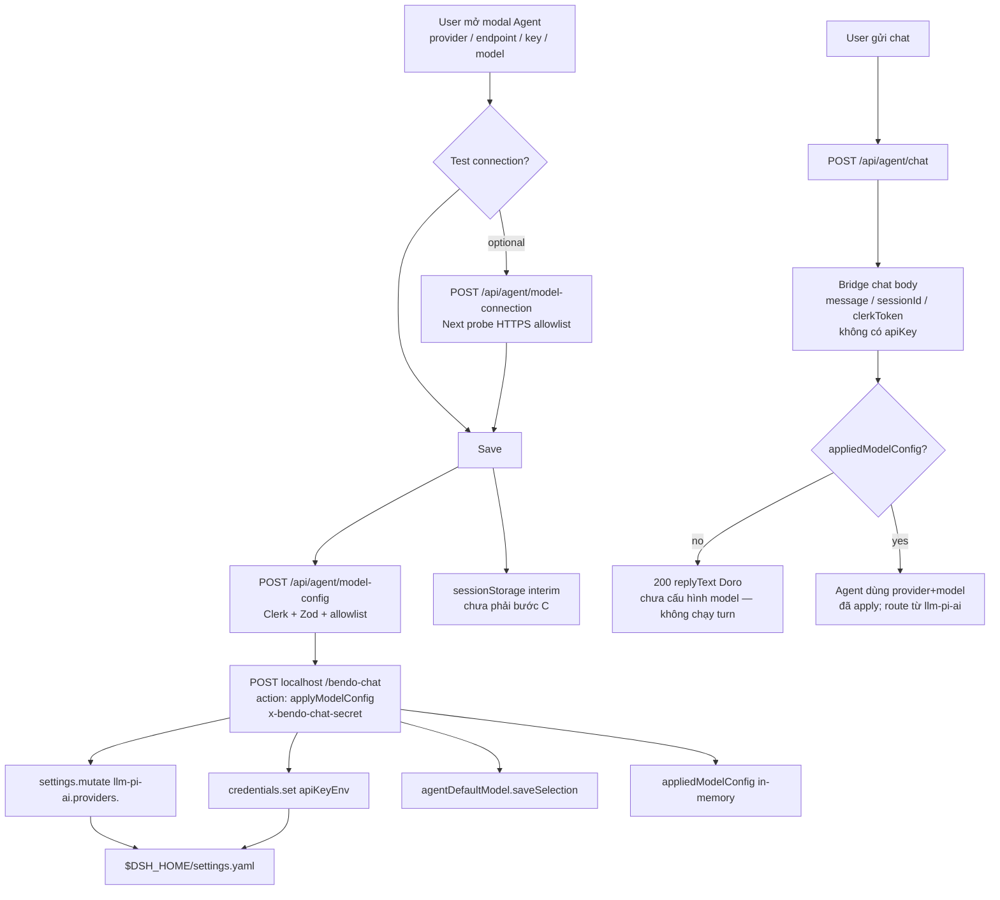

# Agent model — dynamic llm-pi-ai route (bước A–B)

Tài liệu giải thích **vì sao** cần đăng ký route động, **workflow** Save → apply → chat, và **chức năng** đã thêm/sửa trong bước **A** (harness) + **B** (Electron `DSH_HOME`). Không thay thế `bendo-app/AGENTS.md` §10.

**Bước C (đã ship):** persist durable Electron `userData` + `safeStorage`, Save = apply ∧ persist, startup re-apply khi harness ready. Non-Electron vẫn dùng `sessionStorage` sau apply.

**Liên quan:**

| Doc | Vai trò |
| --- | --- |
| [`bendo-app/AGENTS.md`](../bendo-app/AGENTS.md) §10 | Rule product: Save/apply trước chat, không đính kèm key mỗi turn |
| [`agent-model-connection-hardening.md`](./agent-model-connection-hardening.md) | Probe / SSRF / Test connection |
| [`desktop-electron-startup-flow.md`](./desktop-electron-startup-flow.md) | Spawn Next + harness |
| [`desktop-credentials-and-dsh-bridge.md`](./desktop-credentials-and-dsh-bridge.md) | Bridge secret inject |
| [`agent-model-config-save-workflow.md`](./agent-model-config-save-workflow.md) | Save = apply ∧ persist + startup re-apply (sơ đồ + chuỗi function) |
| Doro [`cordis.yml`](../deepseek-harness/bendo-agent(doro)/cordis.yml) comments | Contract apply ngắn trên overlay |

---

## 1. Vấn đề cần giải quyết

Bendo Agent để **user** chọn provider / endpoint / API key / model (Save), rồi chat qua localhost DSH bridge — **không** ship key, **không** gắn secrets vào mỗi chat turn.

Harness chat (`llm-pi-ai`) chỉ phục vụ model khi route đã có trong **`$DSH_HOME/settings.yaml`** (section `llm-pi-ai.providers.<route>`), giống trang Models của dsh web. Chỉ ghi `agent-default-model` (provider + model id) **không đủ**:

- Route không tồn tại / model id không nằm trong catalog đã materialize → **`UNKNOWN_MODEL`**
- Probe “Test connection” (Next → provider) **≠** catalog pi-ai dùng lúc chat
- Vilao **không** nằm trong builtin catalog → phải **hand-declare** (`api` + `baseURL` + `models`)

**Dynamic route** = khi user Save, bridge **đăng ký / cập nhật** profile `llm-pi-ai` cho đúng route dsh, rồi mới cho chat.

---

## 2. Workflow end-to-end (sau A–B)



**Electron (B):** khi app **spawn** harness, `DSH_HOME = {userData}/dsh` → file `settings.yaml` nằm dưới app, tách khỏi `~/.dsh` của CLI / Models page cũ.

---

## 3. Bản đồ bước A–B (và C chưa làm)

| Bước | Mục tiêu | Trạng thái |
| --- | --- | --- |
| **A1** | Apply ghi đủ profile `llm-pi-ai.providers` (không chỉ selection) | Done |
| **A2** | Bảng map Bendo → dsh rõ trong code + merge `models` | Done |
| **A3** | Gate chat: chưa apply → 400 (không fallback cordis) | Done (trước / giữ) |
| **A4** | Test thủ công Save → chat hết `UNKNOWN_MODEL` | Manual |
| **A5** | Doc / comment `cordis.yml` + AGENTS | Done |
| **B6** | Electron spawn: `DSH_HOME={userData}/dsh` + mkdir | Done |
| **B7** | Không migrate `~/.dsh`; Save lại trong Bendo | Done (chốt + doc) |
| **B8** | Verify spawn → settings dưới userData | Manual |
| **C9–C11** | Persist durable Bendo + startup re-apply | **Chưa** |

---

## 4. Bước A — Harness: đăng ký route động

### 4.1 Ý tưởng

`applyModelConfig` trên chat-bridge làm **ba việc** (thứ tự quan trọng):

1. **Credentials** — ghi key vào seam credentials (hoặc `process.env` fallback) dưới tên `apiKeyEnv` của route  
2. **`llm-pi-ai` settings** — `settings.mutate` **set nguyên** `providers.<dshRoute>` (cùng pattern Models page / CustomProviderCard)  
3. **Selection** — `agentDefaultModel.saveSelection({ provider, model })`  
4. **In-memory gate** — set `appliedModelConfig` **sau** khi 1–3 thành công (fail giữa chừng → chat vẫn 400)

Không sửa `cordis.yml` composition để nhét key user. Placeholder `agent-default-model` trong cordis **không** là fallback chat Bendo.

### 4.2 File chính

| File | Thay đổi |
| --- | --- |
| `deepseek-harness/bendo-agent(doro)/chat-bridge.ts` | `BENDO_PROVIDER_ROUTE`, `buildPiAiProviderProfile`, `writePiAiProviderSettings`, `readExistingProviderModels`, gate chat |
| `deepseek-harness/bendo-agent(doro)/cordis.yml` | Comment contract apply + `DSH_HOME` |
| `bendo-app/app/api/agent/model-config/route.ts` | (đã có từ trước A) Next → bridge apply |
| `bendo-app/lib/agent/model-config-api-client.ts` | Client Save |
| `bendo-app/lib/agent/dsh-chat-adapter.ts` | `applyModelConfig` trên bridge |
| `bendo-app/components/agent/model-api-key-dialog.tsx` | Save: apply OK rồi mới `writeStored` |
| `bendo-app/AGENTS.md` §10 | Rule Save/apply + ghi `llm-pi-ai` |

### 4.3 Bảng map Bendo → dsh (`BENDO_PROVIDER_ROUTE`)

| Bendo UI | dsh route (`dshProvider`) | kind | `api` ghi vào profile |
| --- | --- | --- | --- |
| `openrouter` | `openrouter` | catalog | `openai-completions` |
| `gpt` | `openai` | catalog | `openai-completions` |
| `gemini` | `google` | catalog | **omit** (giữ protocol native Google) |
| `vilao` | `vilao` | hand-declare | `openai-completions` |

**Catalog** = pi-ai builtin đã biết route. Apply vẫn pin `models: […]` (agent cần id đã chọn; model slug lạ vẫn serviceable nếu có `api` OpenAI-compat).

**Hand-declare** = không có trong catalog (Vilao). Bắt buộc `api` + `baseURL` + `models` — cùng shape trang Models tạo custom provider.

`apiKeyEnv` tương ứng: `OPENROUTER_API_KEY` / `OPENAI_API_KEY` / `GEMINI_API_KEY` / `VILAO_API_KEY`.

### 4.4 Shape ghi vào `llm-pi-ai.providers.<route>`

Ví dụ Vilao sau Save:

```yaml
llm-pi-ai:
  providers:
    vilao:
      displayName: Bendo
      apiKeyEnv: VILAO_API_KEY
      api: openai-completions
      baseURL: https://api.vilao.ai/v1
      models:
        - id: openrouter/free
          name: openrouter/free
agent-default-model:
  provider: vilao
  model: openrouter/free
```

Chi tiết hành vi:

- **Wholesale `mutate` set** cả profile route → tránh còn `modelOverrides` cạnh `models` (llm-pi-ai reject).
- **Merge models:** đọc models đã có trên route (nếu có), thêm id user vừa apply, không xóa sạch list Models page nếu đang dùng chung route.
- **Gemini:** không set `api: openai-completions` — catalog Google giữ wire native; model lạ ngoài catalog có thể bị settings reject (đúng, báo lỗi lúc apply).

### 4.5 Gate chat (A3)

- Chưa `applyModelConfig` trong process harness → POST chat **200** với `replyText` giọng Doro (vd. chưa cấu hình model) — **không** chạy agent turn  
- Không fallback sang cordis `agent-default-model` (không có key ship)  
- Restart harness → mất `appliedModelConfig` in-memory → soft reply lại cho đến khi Save (hoặc có C)

### 4.6 Vì sao trước đó “default vẫn chat được”?

Thường vì máy đã có route trong `~/.dsh/settings.yaml` từ trang Models / cấu hình tay. Bendo Save chỉ đổi selection → trùng model đã declare thì ổn; đổi provider/model mới (Vilao, slug lạ) → `UNKNOWN_MODEL`. A1–A2 buộc Save luôn đồng bộ route.

---

## 5. Bước B — Electron: `DSH_HOME` → `userData`

### 5.1 Ý tưởng

CLI / Models page mặc định `$DSH_HOME` → `~/.dsh`. Desktop spawn harness phải dùng **home riêng của app** để:

- Settings apply từ Bendo không lẫn với session CLI  
- Packaged app có chỗ ghi được dưới `userData`  
- Mỗi user/máy Electron một cây settings rõ ràng

### 5.2 File chính

| File | Thay đổi |
| --- | --- |
| `desktop/src/main/spawn-harness.ts` | `resolveElectronDshHome`, `ensureElectronDshHome`, force `env.DSH_HOME` khi spawn |
| `desktop/README.md`, `desktop/.env.example` | Doc / override `BENDO_DSH_HOME` |
| Root `AGENTS.md` | Rule desktop `DSH_HOME` |
| `docs/desktop-electron-startup-flow.md` | Bảng bước spawn |

### 5.3 Hành vi

| Trường hợp | `DSH_HOME` |
| --- | --- |
| Electron **spawn** harness | `{app.getPath("userData")}/dsh` (mkdir trước spawn) |
| Override | `BENDO_DSH_HOME` (absolute, `~/…` được expand về home, hoặc relative cwd) |
| Electron **attach** harness đã chạy ngoài | Không đổi — process đó giữ home riêng (`~/.dsh` hoặc env lúc start) |
| `pnpm dsh web` tay (không qua Electron) | Mặc định `~/.dsh` trừ khi export `DSH_HOME` |

**Không** copy tự động từ `~/.dsh` → `userData/dsh`. Sau khi chuyển sang Electron-managed home: mở Agent → **Save lại** model config.

Log spawn ghi `DSH_HOME=…` để đối chiếu runtime log.

### 5.4 Liên hệ với apply (A)

Apply ghi vào **`$DSH_HOME/settings.yaml` của process harness đang phục vụ bridge**.  
Nếu Electron spawn với `userData/dsh` nhưng chat đang attach harness cũ trên `~/.dsh` → Save cập nhật home cũ, không phải `userData`. Muốn đúng B: tắt harness ngoài, để Electron spawn lại.

---

## 6. Phân tầng trách nhiệm (nhanh)

| Tầng | Việc |
| --- | --- |
| UI Bendo | Form + Test + Save; sessionStorage sau apply OK |
| Next `/api/agent/model-config` | Auth, validate, forward apply (không giữ key lâu) |
| Next `/api/agent/chat` | Thin turn; không đính kèm model secrets |
| Chat-bridge | Apply → credentials + **dynamic `llm-pi-ai` route** + selection; gate chat |
| llm-pi-ai | Materialize catalog/hand-declare từ settings |
| Electron main | Spawn harness + inject bridge secret + **`DSH_HOME` userData** |

---

## 7. Kiểm tra thủ công gợi ý (A4 / B8)

1. Tắt harness ngoài (nếu có); mở Electron để nó spawn harness.  
2. Log: `DSH_HOME=…/userData…/dsh`.  
3. Agent → chọn Vilao (hoặc model id không có sẵn) → Save.  
4. Mở `{DSH_HOME}/settings.yaml` — có `llm-pi-ai.providers.<route>` + model id.  
5. Chat — không còn `UNKNOWN_MODEL`.  
6. Đổi model id → Save lại → chat dùng model mới.  
7. Restart harness không Save → chat 400 (chưa có C).

---

## 8. Bước C (đã triển khai)

1. Persist durable: `userData/model-config.json` + `safeStorage` cho API key (IPC `bendo:model-config:save` / `load`).  
2. Startup: khi harness ready → đọc persist → bridge `applyModelConfig` (retry transient).  
3. Save pass chỉ khi apply ∧ persist đều OK; apply trên Save single-shot (không auto-retry); persist fail → retry rồi mới fail UI.

C không thay A–B. Chi tiết: `desktop/prompts/agent-model-config-persist-c.md`.

---

## 9. Tóm tắt một câu

**A** = Save không chỉ chọn model — bridge **tạo/cập nhật dynamic provider route** trong `llm-pi-ai` rồi mới chat.  
**B** = trên Electron, route đó sống dưới **`userData/dsh`**, không phụ thuộc `~/.dsh`.  
**C** = nhớ config qua lần mở app sau — vẫn mở.
