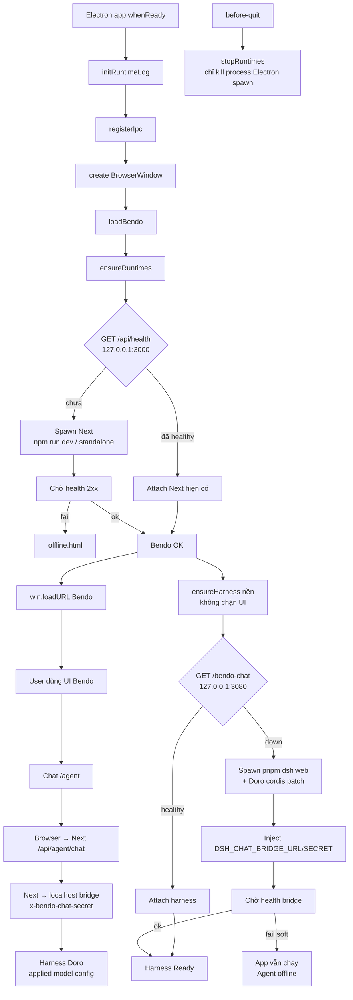

# Desktop Electron — startup & Agent flow

Flow khi mở Electron shell (`desktop/`, `npm start`, không smoke). Không thay thế `desktop/README.md` hay root `AGENTS.md`.

---

## 1. Tổng quan

---

## 2. Thứ tự ngắn

1. Electron ready → runtime log + IPC + cửa sổ.
2. **Đợi Next** (attach nếu đã healthy, không thì spawn) rồi `loadURL` Bendo.
3. **Harness chạy nền** (attach/spawn + inject bridge secret). Lỗi soft — không chặn mở app.
4. Agent chat: Browser → Next `/api/agent/chat` → DSH bridge localhost → harness.
5. Quit: `stopRuntimes` chỉ dừng Next/harness **do session này spawn**.

---

## 3. Chi tiết theo bước

| Bước | Module | Việc |
| --- | --- | --- |
| Ready | `main.ts` | `initRuntimeLog`, `registerIpc`, `createWindow` |
| Ensure Bendo | `runtime-manager` → `spawn-next` | Health `BENDO_HEALTH_URL` (default `:3000/api/health`); spawn `npm run dev` (dev) hoặc standalone (packaged) |
| Load UI | `main.ts` | `BrowserWindow.loadURL(BENDO_APP_URL)` hoặc `offline.html` nếu fail |
| Bridge creds | `bridge-credentials.ts` | Env session hoặc `userData/bridge-credentials.json`; inject vào child Next + harness |
| Ensure harness | `spawn-harness.ts` | Health `…/bendo-chat`; spawn `pnpm dsh web --patch './bendo-agent(doro)/cordis.yml' --no-open` |
| Chat | `bendo-app` + Doro | Thin path; Save applies user model config via bridge (`action: applyModelConfig`). Durable userData persist still planned. |
| Shutdown | `runtime-shutdown.ts` | Kill owned children only |

---

## 4. Smoke mode

`BENDO_SMOKE=1`: load URL có sẵn, **không** spawn Next/harness. Không dùng để test Agent chat.

---

## 5. File liên quan

- `desktop/src/main/main.ts`
- `desktop/src/main/runtime-manager.ts`
- `desktop/src/main/spawn-next.ts`
- `desktop/src/main/spawn-harness.ts`
- `desktop/src/main/bridge-credentials.ts`
- `desktop/README.md`
- Plan user model config (persist local, không đính kèm chat): `bendo-app/AGENTS.md` §10
